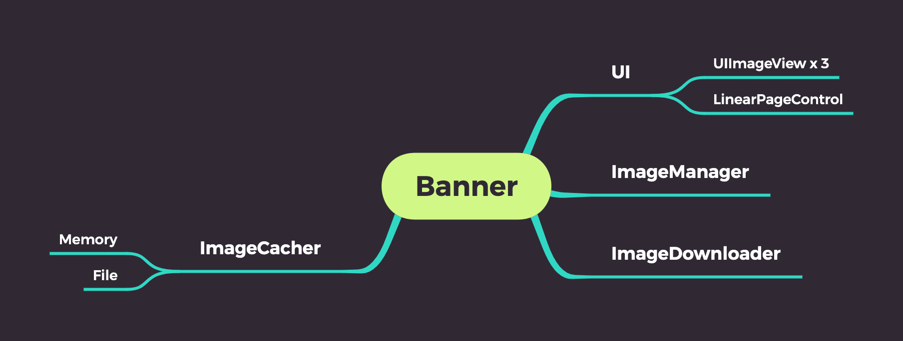
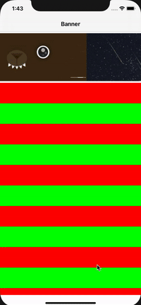
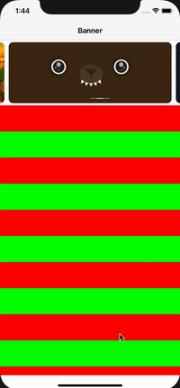
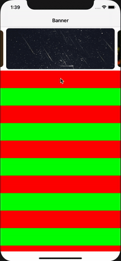

# Banner

适用于常规场景的banner，可构建于纯代码、storyboard、xib，可使用autoLayout、frame布局

图片缓存于
`NSSearchPathForDirectoriesInDomains(.cachesDirectory, .userDomainMask, true)[0] + "/com.zhouwk.banners/"`



# 样式

* 默认样式

    

* 设置间距
    ```
    banner.config(itemsHorizontalMargin: 10, preloadEdge: 10, cornerRadius: 10)
    ```
    

* 设置间距和缩放系数
    ```
    banner.config(itemsHorizontalMargin: 10, preloadEdge: 10, zoom: 0.9, cornerRadius: 10)
    ```
    
    
    
# Installation

```
支持Swift Package Manager
```
    
